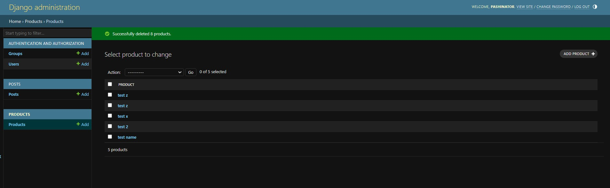
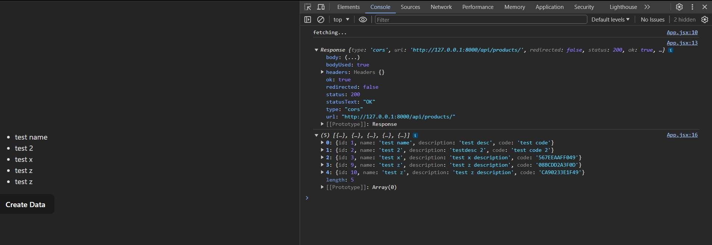

# Django + React Full Stack App

### Using 2 separate apps: backend and frontend, linked together with Django Rest Framework and Django cors headers packages
### Create virtual environment for the backend 
### Using Vite for the React app
### Send data from ReactJS to Django, in order to create new objects(using viewsets from Django Rest) and update the page

